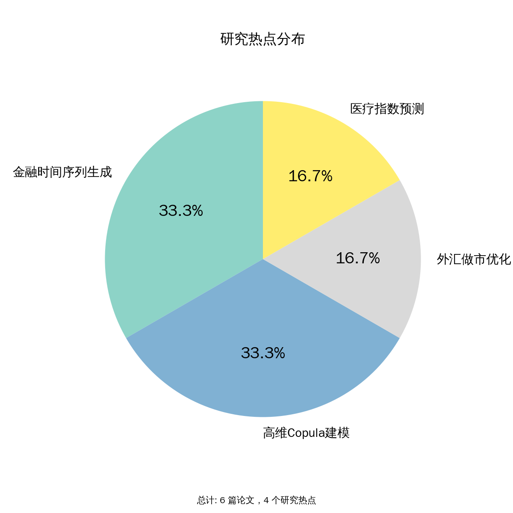
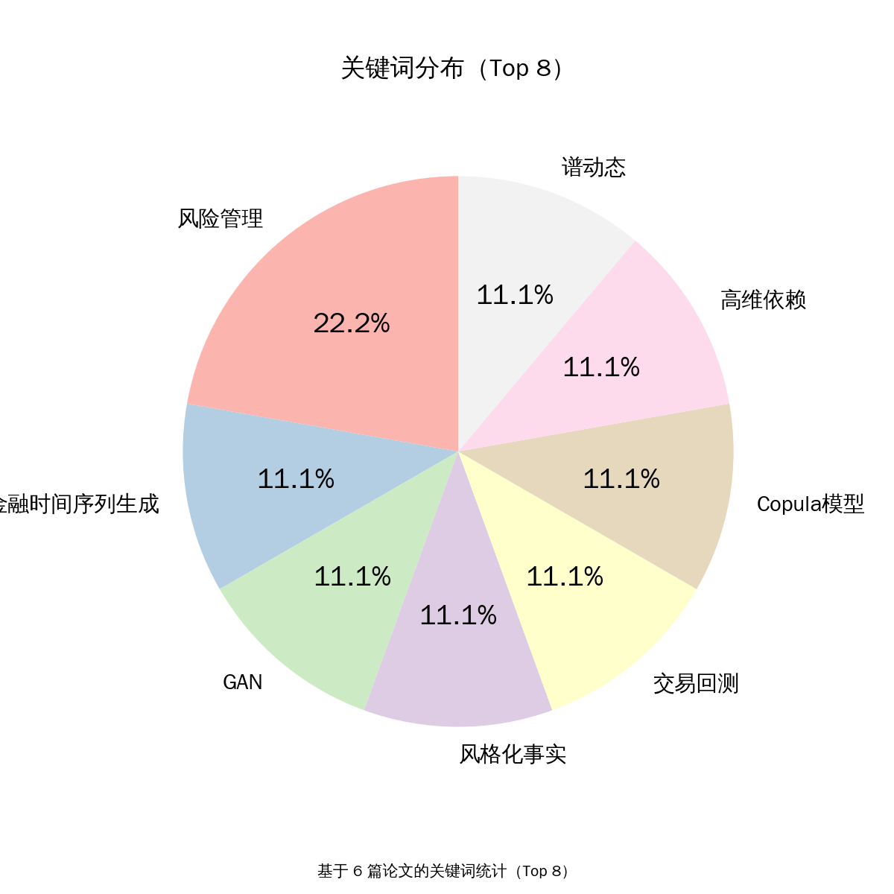

# Arxiv Q-Fin (量化金融) 每日研报

> **更新时间**：2026-01-23 15:43:53
> **论文数量**：6 篇
> **推荐分布**：⭐推荐 4 篇 | 📌边缘可看 1 篇 | ❌不推荐 1 篇
> **自动生成**：By Arxiv_Q-Fin_Search-Recommendation_Daily Agent

---

## 📊 今日趋势速览 (Trend Analysis)

<h4 style='margin-bottom: 10px;'>研究热点分布</h4>

<h4 style='margin-bottom: 10px;'>关键词分布（Top 8）</h4>

###  金融时间序列生成（2 篇论文）
> **赛道观察：** 聚焦于通过生成对抗网络（GAN）结合金融风格化事实约束，解决合成数据在交易回测中的统计一致性和实际可用性问题。
- Beyond Visual Realism: Toward Reliable Financial Time Series Generation

###  高维Copula建模（2 篇论文）
> **赛道观察：** 探索高维依赖结构的动态建模与正则化技术，重点解决市场压力时期的系统性风险捕捉问题。
- Spectral Dynamics and Regularization for High-Dimensional Copulas

###  外汇做市优化（1 篇论文）
> **赛道观察：** 将瞬态市场冲击模型引入做市框架，提升大库存风险管理性能，突破传统瞬时/永久冲击假设的局限性。
- Market Making and Transient Impact in Spot FX

###  医疗指数预测（1 篇论文）
> **赛道观察：** 结合创新特征工程与可解释机器学习，突破传统技术指标的滞后性限制，实现医疗指数短期波动的有效预测。
- Demystifying the trend of the healthcare index: Is historical price a key driver?

---

## 📝 论文详细列表

## 1. ⭐ Beyond Visual Realism: Toward Reliable Financial Time Series Generation
- **中文标题**: 超越视觉真实：迈向可靠的金融时间序列生成
- **Link**: http://arxiv.org/abs/2601.12990v1
- **推荐决策:** 推荐
- **决策理由:** 命中量化金融方向，解决了金融数据生成中的关键痛点，具有明确的风险管理和交易策略评估应用价值。
- **关键词:** 金融时间序列生成、GAN、风格化事实、交易回测、风险管理
- **核心痛点:** 现有金融时间序列生成模型虽能生成视觉上真实的数据，但在交易回测中表现不稳定，无法捕捉金融不对称性和尾部事件。
- **应用价值:** 为风险管理和算法交易提供可靠的合成数据，支持压力测试和隐私保护机器学习。
- **总结:** 论文提出SFAG模型，通过将金融风格化事实直接嵌入训练目标，生成既统计一致又实际可用的时间序列数据。实验表明SFAG在交易回测中显著优于传统GAN。
- **技术创新:** 1) 提出风格化事实对齐GAN（SFAG），将关键金融风格化事实转化为可微结构约束；2) 联合优化对抗损失和结构约束（厚尾分布、波动聚集、杠杆效应、跨尺度波动相关性）；3) 在沪深300指数（2004-2024）上验证，SFAG生成的合成数据在动量策略回测中表现稳健。

---

## 2. ⭐ Spectral Dynamics and Regularization for High-Dimensional Copulas
- **中文标题**: 高维Copula的谱动态与正则化
- **Link**: http://arxiv.org/abs/2601.13281v1
- **推荐决策:** 推荐
- **决策理由:** 命中风险管理方向，方法具有明确的投资组合管理和风险控制应用场景，实验设计严谨。
- **关键词:** Copula模型、高维依赖、谱动态、风险管理、投资组合优化
- **核心痛点:** 现有高维Copula模型难以同时捕捉时间变化、不对称性和尾部依赖，且缺乏有效的正则化方法。
- **应用价值:** 提升高维金融资产依赖结构建模能力，支持更准确的风险度量和投资组合优化。
- **总结:** 论文提出新型高维Copula模型，通过谱动态和正则化技术解决现有方法的局限性，实证显示能有效捕捉市场压力时期的系统性风险。
- **技术创新:** 1) 提出基于广义双曲偏t-Copula的谱动态模型；2) 对依赖矩阵特征值进行分数驱动动态建模；3) 使用非线性收缩解决无条件特征值谱偏差；4) 在100只跨国跨行业股票上验证，优于聚类因子Copula。

---

## 3. ⭐ Look-Ahead-Bench: a Standardized Benchmark of Look-ahead Bias in Point-in-Time LLMs for Finance
- **中文标题**: Look-Ahead-Bench：金融PiT LLMs前瞻偏差标准化基准
- **Link**: http://arxiv.org/abs/2601.13770v1
- **推荐决策:** 推荐
- **决策理由:** 直接解决金融AI应用的核心痛点，评估框架可立即应用于量化交易系统的模型筛选。
- **关键词:** 大语言模型、前瞻偏差、点-in-time、金融LLM、交易策略
- **核心痛点:** 现有金融LLM评估方法无法有效检测训练数据泄露导致的前瞻偏差，造成回测结果虚高。
- **应用价值:** 为金融LLM的实盘部署提供可靠的偏差检测工具，降低策略失效风险。
- **总结:** 论文提出标准化基准来评估金融LLM的前瞻偏差，发现传统模型存在显著数据泄露问题，而PiT模型表现稳健。
- **技术创新:** 1) 设计双周期评估框架（2021年内样本 vs 2024年外样本）；2) 提出alpha衰减指标量化前瞻偏差；3) 测试Llama 3.1/DeepSeek与PiT模型在5只科技股上的表现差异。

---

## 4. ⭐ Beyond Carr Madan: A Projection Approach to Risk-Neutral Moment Estimation
- **中文标题**: 超越Carr Madan：风险中性矩估计的投影方法
- **Link**: http://arxiv.org/abs/2601.14852v1
- **推荐决策:** 推荐
- **决策理由:** 命中金融建模方向，提出的投影方法具有明确工程实现路径，可应用于期权定价和风险管理系统，实证结果证明其在外汇市场的实用价值。
- **关键词:** 风险中性矩估计、期权定价、投影方法、市场微观结构、金融建模
- **核心痛点:** 现有Carr-Madan方法在有限样本下无法保证最优定价误差，且无法处理高维联合矩估计问题。
- **应用价值:** 提升衍生品定价精度，解决外汇市场联合尾部风险测量难题，可直接应用于风险管理与对冲策略。
- **总结:** 该论文提出一种基于投影的风险中性矩估计方法，优于传统Carr-Madan近似。通过将目标收益函数投影到期权收益空间，实现有限样本最优定价误差，并解决高维联合矩估计问题。方法在VIX/SVIX估计和外币联合尾部风险测量中展现显著优势。
- **技术创新:** 1) 提出基于投影的矩估计方法，将目标收益函数投影到交易期权收益的线性空间；2) 推导有限样本误差界，证明投影方法在交易期权跨度内达到最小定价误差；3) 扩展至高维场景，推导市场完备性条件（需无限多组合期权）；4) 在模拟实验中，VIX/SVIX估计精度显著提升；5) 实证应用：仅用外汇期权数据恢复联合尾部风险，预测货币组合崩盘。

---

## 5. Market Making and Transient Impact in Spot FX
- **中文标题**: 外汇做市与瞬时冲击
- **Link**: http://arxiv.org/abs/2601.13421v1
- **推荐决策:** 边缘可看
- **决策理由:** 虽属算法交易方向，但应用场景较窄（外汇做市），且创新性主要体现在模型扩展而非系统级突破。
- **关键词:** 外汇做市、瞬时冲击、库存风险、Almgren-Chriss模型、执行优化
- **核心痛点:** 传统做市模型假设市场冲击为瞬时或永久性，与实证观察到的瞬态冲击特性不符。
- **应用价值:** 优化外汇做市商的报价和对冲策略，降低交易成本和市场冲击。
- **总结:** 论文将瞬态市场冲击引入做市模型，通过理论分析和数值实验证明其对大库存风险管理的改进效果。
- **技术创新:** 1) 将Obizhaeva-Wang瞬态冲击模型引入做市框架；2) 建立包含弹性冲击状态的HJB方程；3) 数值求解显示考虑冲击弹性可提升大库存风险管理性能。

---

## 6. Demystifying the trend of the healthcare index: Is historical price a key driver?
- **中文标题**: 揭秘医疗保健指数趋势：历史价格是关键驱动因素吗？
- **Link**: http://arxiv.org/abs/2601.14062v1
- **推荐决策:** 不推荐
- **决策理由:** 虽涉及金融时间序列预测，但与核心关注的量化交易/推荐系统关联度低，方法创新性有限。
- **关键词:** 医疗保健指数、OHLC数据、机器学习、特征工程、可解释性
- **核心痛点:** 医疗指数短期波动缺乏有效的预测框架，传统技术指标存在滞后性。
- **应用价值:** 提供医疗指数短期预测工具，支持投资决策和医疗经济稳定性分析。
- **总结:** 论文通过创新特征工程和可解释ML模型，证明历史价格结合实时比率特征可有效预测医疗指数次日走势。
- **技术创新:** 1) 构建包含原始价格、波动率指标和新型实时比率特征的三类特征集；2) 使用SHAP分析特征重要性；3) 在美印市场5年数据（含COVID周期）上验证，准确率超0.8。

---

---
*Generated by AI Agent based on arXiv (q-fin)*
